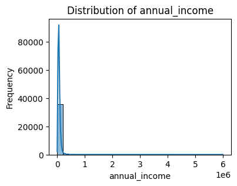
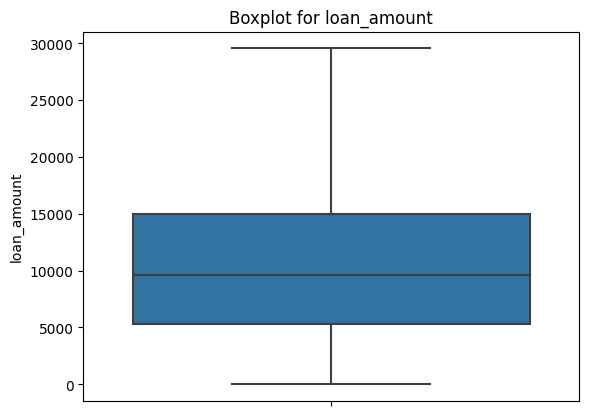
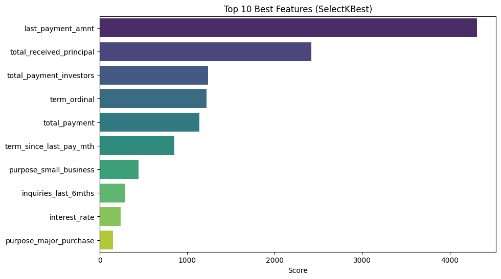
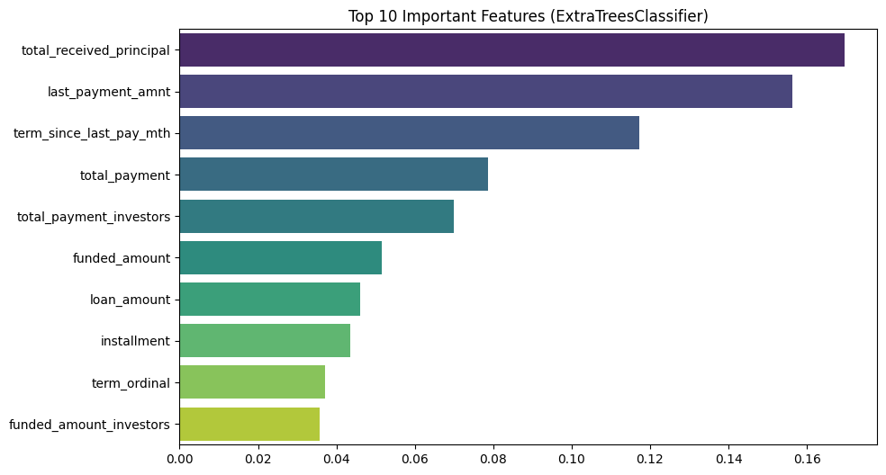
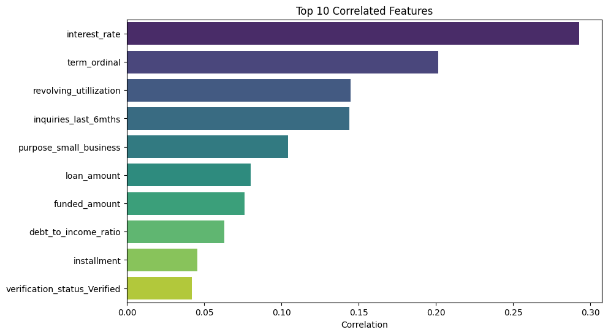
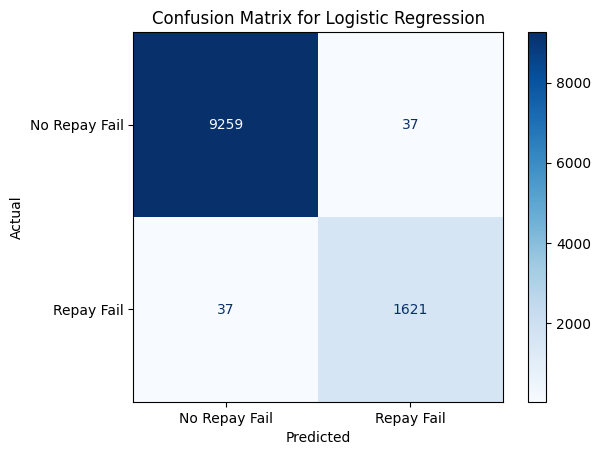
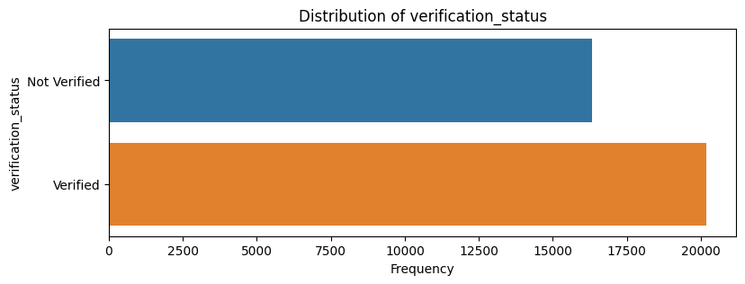

# Project Documentation

## Setup (Skip this section if you are not intending to run in a local environment)

To reproduce the project on your local machine, follow the steps below:

1. Clone the repository on your local machine:

    ```sh
    git clone repo_name
    ```

2. Install the required packages. It is advisable to create a new virtual environment to run the project independently. This project is run using Python version 3.*:

    ```sh
    pip install -r requirements.txt
    ```

3. Next, proceed to open the notebooks and run accordingly.

---

## 📑 Introduction

NotALoanShark Sdn. Bhd. provides loans as its business model. As a Python Developer at NotALoanShark Sdn. Bhd., I was given a task to predict which of the company’s existing borrowers will fail repayment or default on their loans.

To perform this task, I have decided to use the Cross-Industry Standard Process for Data Mining (CRISP-DM) as the main data science lifecycle framework. CRISP-DM consists of six major stages, but for this assessment, I am only focusing on the first five stages.


*Figure 1: CRISP-DM methodology*

---

## 📝 Stage 1: Business Understanding

NotALoanShark Sdn. Bhd. depends strongly on the accuracy of the applicant/customer profile given to apply for a loan facility. Any misinformation may expose the company to high risk of financial loss. In this task, the company is exposed to risk if:

- A performing borrower is misclassified as high default, the company would need to spend more money on retaining these false-positive segments.
- A poor-performing borrower is misclassified as performing, the company will be exposed to financial loss instead of having the chance to have a good exit relationship with the customer as soon as possible.

### 🎯 Business Objectives

Thus, the company aims to reduce capital loss by implementing AI in its business process to predict potential loan defaults of existing customers.

---

## 💾 Stage 2: Data Understanding

In this phase, data exploration is done to understand the available fields, data quality, and simple statistics that can enhance data understanding. The historical data given contains information about existing customers' loan status and whether they ‘defaulted’ or not. The aim is to identify patterns which indicate if a person is likely to default, which may be used for taking actions such as rejecting the loan, reducing the loan limit, lending (to risky applicants) at a higher interest rate, etc.

### Data Dictionary

| Column                        | Data Type        | Description                                               | Number of Missing Values | Percentage of Missing Values |
|-------------------------------|------------------|-----------------------------------------------------------|--------------------------|------------------------------|
| ('Unnamed: 0 ','id','member_id') | int64          | Unique identifier of the customer                         | 0                        | 0.000%                       |
| loan_amount                   | float64          | Loan amount applied by the customer                       | 1                        | 0.003%                       |
| funded_amount                 | float64          | Amount funded for the loan                                | 1                        | 0.003%                       |
| funded_amount_investors       | float64          | Amount funded by investors                                | 1                        | 0.003%                       |
| term                          | object           | Term of the loan (e.g., 36 months, 60 months)             | 0                        | 0.000%                       |
| interest_rate                 | float64          | Interest rate of the loan                                 | 0                        | 0.000%                       |
| installment                   | float64          | Monthly installment amount                                | 1                        | 0.003%                       |
| employment_length             | object           | Length of employment of the borrower                      | 993                      | 2.581%                       |
| home_ownership                | object           | Home ownership status (e.g., own, rent, mortgage)         | 0                        | 0.000%                       |
| annual_income                 | float64          | Annual income of the borrower                             | 2                        | 0.005%                       |
| verification_status           | object           | Status of income verification                             | 0                        | 0.000%                       |
| issue_date                    | datetime64[ns]   | Date the loan was issued                                  | 0                        | 0.000%                       |
| loan_status                   | object           | Current status of the loan                                | 0                        | 0.000%                       |
| purpose                       | object           | Purpose of the loan                                       | 0                        | 0.000%                       |
| zip_code                      | object           | Zip code of the borrower                                  | 0                        | 0.000%                       |
| address_state                 | object           | State of the borrower's address                           | 0                        | 0.000%                       |
| debt_to_income_ratio          | float64          | Debt-to-income ratio of the borrower                      | 0                        | 0.000%                       |
| no_delinquency_2yrs           | float64          | Number of delinquencies in the past 2 years               | 1                        | 0.003%                       |
| earliest_credit_line          | datetime64[ns]   | Date of the earliest credit line                          | 0                        | 0.000%                       |
| inquiries_last_6mths          | float64          | Number of credit inquiries in the last 6 months           | 1                        | 0.003%                       |
| months_since_last_delinquency | float64          | Months since the last delinquency                         | 24,363                    | 63.313%                      |
| no_open_accounts              | float64          | Number of open accounts                                   | 1                        | 0.003%                       |
| public_records                | float64          | Number of public records                                  | 1                        | 0.003%                       |
| revolving_balance             | float64          | Revolving credit balance                                  | 4                        | 0.010%                       |
| revolving_utillization        | object           | Revolving credit utilization rate                         | 59                       | 0.153%                       |
| no_total_account              | float64          | Total number of accounts                                  | 1                        | 0.003%                       |
| total_payment                 | float64          | Total amount paid by the borrower                         | 1                        | 0.003%                       |
| total_payment_investors       | float64          | Total amount paid to investors                            | 1                        | 0.003%                       |
| total_received_principal      | float64          | Total principal received by the borrower                  | 1                        | 0.003%                       |
| total_received_interest       | float64          | Total interest received by the borrower                   | 1                        | 0.003%                       |
| last_payment_date             | datetime64[ns]   | Date of the last payment made                             | 71                       | 0.185%                       |
| last_payment_amnt             | float64          | Amount of the last payment made                           | 1                        | 0.003%                       |
| next_payment_date             | datetime64[ns]   | Date of the next payment due                              | 35,097                    | 91.208%                      |
| last_credit_pull_date         | datetime64[ns]   | Date of the last credit pull                              | 3                        | 0.008%                       |
| repay_fail                    | int64            | Indicator if the repayment failed                         | 0                        | 0.000%                       |

- Notice that some features have more than 91% missing value. It will not give any insight in this analysis.
- For features with less than 5% missing values, it can be simply removed and not significantly impact analysis.
- Missing values threshold reference: [ScienceDirect](https://www.sciencedirect.com/science/article/pii/S0895435618308710#:~:text=Statistical%20guidance%20articles%20have%20stated,18%5B%2019%5D).

**Raw data shape:**
- Number of rows: 38,480  
- Number of columns: 37 

The company is assumed to provide terms of 36 months and 60 months only. The dataset shows that more customers preferred a 3-year term than a 5-year loan term.

| Term       | Count |
|------------|-------|
| 36 months  | 28,593 |
| 60 months  | 9,887  |

For features with multiple categorical values, exploration is done to see if the values have a strong relationship with `repay_fail`. 

Refer to the loan status count by `repay_fail` column:

| Loan Status                                        | Repay Fail | Count |
|----------------------------------------------------|------------|-------|
| Charged Off                                        | 1          | 5,111  |
| Current                                            | 0          | 867   |
| Default                                            | 1          | 2     |
| Does not meet the credit policy. Status:Charged Off| 1          | 689   |
| Does not meet the credit policy. Status:Fully Paid | 0          | 1,782  |
| Fully Paid                                         | 0          | 29,987 |
| In Grace Period                                    | 0          | 15    |
| Late (16-30 days)                                  | 1          | 7     |
| Late (31-120 days)                                 | 1          | 20    |

- Checking the proportion for categorical data is important to avoid having an obvious strong linear relationship with the target variable. If it is a 1 to 1 relationship, the model will predict accurately but overfit due to poor generalization.
- The two features `loan_status` and `purpose` show non-direct distribution of unique values with `repay_fail`.

For data quality, logical and sensible data checks were done with the following scenarios, and no such exceptions were found:
1. `funded_amount_investor` larger than `funded_amount` (no such case)
2. `funded_amount` larger than `total loan_amount` (no such case)
3. `loan_amount` and `funded_amount` are equivalent (no such case)

Initially, the target label (`repay_fail`) had imbalanced data:
| Repay Fail | Proportion |
|------------|------------|
| 0          | 0.848519   |
| 1          | 0.151481   |

---

## 🧹 Stage 3: Data Preparation

This stage is for determining which features are relevant to use for analysis. Data cleaning is also done in this stage. It should also include the datatype of each feature. Feature selection is done here for finding relevant features. Then any imbalanced data is oversampled and outliers are removed.

### 1. Summary Observation of 1st EDA

- Columns (`'Unnamed: 0', 'id', 'member_id'`) are not relevant for analysis. They only act as unique customer identifiers and do not provide significant information on customer loan behavior. They can be dropped.
- Columns (`'zip_code', 'address_state'`) are also not required as they do not assist in describing the customers' loan behavior. They can be dropped.
- Features with the most missing values:
    - `months_since_last_delinquency`: 24,363
    - `next_payment_date`: 35,097
    - `employment_length`: 993
    - `last_payment_date`: 71
    - `revolving_utilization`: 59
- Datatypes. Some features can be transformed into discrete nominal/ordinal datatypes instead of object which refers to string:
    - `term`, `employment_length`, `home_ownership`, `verification_status`, `loan_status`, `purpose`
- The data contains an imbalance class of customers with records of default (repayment failed with 85%) and those who did not (15%).

### 2. 1st Data Preprocessing

1. General cleaning of all features to check and remove special characters, etc.
2. Remove unnecessary columns:
    - Columns that do not contribute to identifying the probability of customer default: `'Unnamed: 0', 'id', 'member_id', 'zip_code', 'address_state'`.
    - Columns with many missing values as these features are not useful with more than half of the data empty.
3. Clean and drop similar features:
    - For the `loan_status` feature, not all value types will result in `repay_fail` and should be dropped.
    - Only retain values: `'Fully Paid', 'Charged Off', 'Does not meet the credit policy. Status:Fully Paid', 'Does not meet the credit policy. Status:Charged Off', 'Late (16-30 days)', 'Late (31-120 days)', 'Default'`.
    - The feature itself is very similar to `repay_fail` after the filtered step above.
4. Remove missing values below 5% proportion.
5. Extrapolate features with datetime datatype to produce more meaningful insight such as extracting only the year from it.
    - As some dates might be removed as in prediction, it is almost impossible to know when an event happens at a specific date.
    - The dataset is not specified on a timeframe, using the minimum (from `earliest_credit_line`) and maximum year (`last_credit_pull_date`) is taken as the time range of the dataset.
    - The data is assumed to consist of customers from 1946 to 2016.
    - The data is assumed to be a snapshot and as of the position of 2016.
    - A new feature is created to see the difference between the term and completed month term payment:

    | Column                  | Average    | Min   | Max  |
    |-------------------------|------------|-------|------|
    | Term                    | 41.77      | 36.0  | 60.0 |
    | Repay Fail              | 0.151      | 0.0   | 1.0  |
    | Term Since Last Pay (months) | 28.36 | 1.0   | 85.0 |
    | Difference in Terms Completed | 13.41 | -49.0 | 59.0 |

    - Note that -49 here means the loan exceeded the term by 49 months. This is a notable issue for management to identify the root cause.
    - There are **6033** customers that have a last payment date exceeding the term period (as from the issued date) but 99% of them are not default.

---

## 📊 Stage 4: Modeling

### Data Visualization

- Most continuous features are skewed and not in a normal distribution.
- The feature `interest_rate` is in a standard distribution and later statistics applied on it can represent the population.
- `Annual_income` is heavily right-skewed (30.8) due to high variance between large data and mean data. Also, the same case for `delinquency`, `inquiries`, `public records`, `revolving_balance`.



*Figure 2: Annual Income Distribution*

### 2nd Data Preprocessing

1. Remove Outliers:
    - Features assumed to occur at random include:
        - `term`, `no_delinquency_2yrs`, `no_open_accounts`, `home_ownership`, `purpose`
    - These features vary between customers (not all have public records, the same type of home ownership, and loan purpose, customer onboarding date).
    - Removing outliers in the target variable may cause overfitting due to the already existing imbalance.
    - Outliers are removed using the interquartile range where limits are applied. Refer to the sample boxplot of cleaned `loan_amount` features:

    Lower Bound: \( lower_limit = Q_1 - 1.5 * IQR \)

    Upper Bound: \( upper_limit = Q_3 + 1.5 * IQR \)

    

    *Figure 3: Annual Income Boxplot Cleaned*

2. Summary statistics after data cleanup as below. Note that the summary does not consider the step of oversampling first as it is supposed to act as a representation of the population. Oversampling only upscales or produces synthetic data which is not the correct representation of the data's sample statistic.

| Column                        | Average       | Min     | Max         |
|-------------------------------|---------------|---------|-------------|
| Loan Amount                   | 10930.66      | 0.0     | 29550.00    |
| Funded Amount                 | 10692.88      | 0.0     | 29812.50    |
| Funded Amount (Investors)     | 9947.77       | 0.0     | 27575.00    |
| Interest Rate                 | 12.12         | 2.08    | 22.20       |
| Installment                   | 320.19        | 0.0     | 821.53      |
| Annual Income                 | 65574.47      | 0.0     | 146192.00   |
| Debt-to-Income Ratio          | 13.36         | 0.0     | 29.99       |
| Number of Delinquencies (2 yrs)| 0.0          | 0.0     | 0.0         |
| Inquiries (Last 6 Months)     | 1.04          | 0.0     | 5.0         |
| Number of Open Accounts       | 9.30          | 0.0     | 21.0        |
| Public Records                | 0.0           | 0.0     | 0.0         |
| Revolving Balance             | 12085.03      | 0.0     | 37669.50    |
| Revolving Utilization         | 0.49          | 0.0     | 1.19        |
| Total Accounts                | 22.03         | 1.0     | 53.0        |
| Total Payment                 | 11618.92      | 0.0     | 32150.99    |
| Total Payment (Investors)     | 10867.03      | 0.0     | 30777.46    |
| Total Received Principal      | 9470.91       | 0.0     | 26008.03    |
| Total Received Interest       | 1913.04       | 0.0     | 5734.53     |
| Last Payment Amount           | 2116.92       | 0.0     | 8017.86     |
| Repay Fail                    | 0.151316      | 0.0     | 1.0         |
| Customer Onboard Year         | 1996.97       | 1983.5  | 2008.0      |
| Years as Customer             | 19.03         | 8.0     | 32.5
| Months Since Last Payment     | 28.36         | 1.0     | 65.5        |
| Issue Date Year               | 2010.20       | 1999.0  | 2011.0      |
| Home Ownership NONE           | 0.000110      | 0.0     | 1.0         |
| Home Ownership OTHER          | 0.003369      | 0.0     | 1.0         |
| Home Ownership OWN            | 0.074056      | 0.0     | 1.0         |
| Home Ownership RENT           | 0.478350      | 0.0     | 1.0         |
| Verification Status Verified  | 0.552954      | 0.0     | 1.0         |
| Purpose Credit Card           | 0.130392      | 0.0     | 1.0         |
| Purpose Debt Consolidation    | 0.467149      | 0.0     | 1.0         |
| Purpose Educational           | 0.010188      | 0.0     | 1.0         |
| Purpose Home Improvement      | 0.075042      | 0.0     | 1.0         |
| Purpose House                 | 0.009832      | 0.0     | 1.0         |
| Purpose Major Purchase        | 0.054282      | 0.0     | 1.0         |
| Purpose Medical               | 0.017473      | 0.0     | 1.0         |
| Purpose Moving                | 0.014625      | 0.0     | 1.0         |
| Purpose Other                 | 0.100786      | 0.0     | 1.0         |
| Purpose Renewable Energy      | 0.002273      | 0.0     | 1.0         |
| Purpose Small Business        | 0.046723      | 0.0     | 1.0         |
| Purpose Vacation              | 0.008983      | 0.0     | 1.0         |
| Purpose Wedding               | 0.024074      | 0.0     | 1.0         |
| Term Ordinal                  | 0.240298      | 0.0     | 1.0         |
| Employment Length Ordinal     | 4.897461      | 0.0     | 10.0        |

### 3. Feature Selection

- Oversampling is done on training data to assist in feature selection as it might reduce bias due to `repay_fail` class imbalance.
- Then data is normalized using MinMaxScaler (turning each feature into a range of 0 to 1) to avoid feature importance being biased towards high margin value differences.
- Methods SelectKBest, ExtraTreeClassifier, and correlation techniques are used with the following results:



*Figure 4: SelectKBest Features Importance*



*Figure 5: ExtraTreesClassifier Features Importance*



*Figure 6: Correlation Features Importance*

### Consolidated Features

Below are the consolidated features based on the feature importance methods done:

1. last_payment_amnt
2. total_received_principal
3. term_ordinal
4. total_payment_investors
5. total_payment
6. term_since_last_pay_mth
7. purpose_small_business
8. inquiries_last_6mths
9. interest_rate
10. purpose_credit_card
11. funded_amount
12. installment
13. loan_amount
14. funded_amount_investors
15. interest_rate
16. revolving_utillization
17. purpose_small_business
18. debt_to_income_ratio
19. verification_status_Verified
20. purpose_major_purchase

The final cleaned data has 36,513 rows and 21 features.

---

## 🛠️ Stage 5: Model Preparation

1. The data is normalized once again to avoid bias in prediction due to high variance between features.
2. The data is split into train and test sets (70:30).
3. For training data, oversampling is done instead of the whole data to preserve authentic real value for model testing.
4. Five classification models are selected with randomly assigned hyperparameter values accordingly:

| Model               | Hyperparameters                                     |
|---------------------|------------------------------------------------------|
| SVM                 | {'classifier__C': [0.1, 1, 10], 'classifier__kernel': ['linear', 'rbf']} |
| Logistic Regression | {'classifier__C': [0.1, 1, 10], 'classifier__solver': ['liblinear']}    |
| Naive Bayes         | {}                                                   |
| Random Forest       | {'classifier__n_estimators': [50, 100, 200], 'classifier__max_depth': [None, 10, 20]} |
| Decision Tree       | {'classifier__max_depth': [None, 10, 20], 'classifier__min_samples_split': [2, 5, 10]} |

5. The models are run inside a pipeline and use GridSearchCV, enabling multiple cross-validation to get average evaluation metrics scores.
6. The focus evaluation metrics score used are F1, precision, and recall. The F1 score provides an estimation of the correct proportion of true positive and true negative predictions.
7. The F1 score for training data is recorded as follows:

| Model                | C    | Kernel | Solver     | Max Depth | n_estimators | Min Samples Split | Best F1 Score |
|----------------------|------|--------|------------|-----------|--------------|-------------------|---------------|
| SVM                  | 10.0 | rbf    | NaN        | NaN       | NaN          | NaN               | 0.993936      |
| Logistic Regression  | 10.0 | NaN    | liblinear  | NaN       | NaN          | NaN               | 0.987572      |
| Random Forest        | NaN  | NaN    | NaN        | NaN       | 100.0        | NaN               | 0.999608      |
| Decision Tree        | NaN  | NaN    | NaN        | NaN       | NaN          | 2.0               | 0.996645      |

8. The model is then tested with test data that was reserved earlier with the following results:

| Model                | F1 Score | Precision | Recall  |
|----------------------|----------|-----------|---------|
| SVM                  | 0.984399 | 0.998759  | 0.970446|
| Logistic Regression  | 0.977684 | 0.977684  | 0.977684|
| Naive Bayes          | 0.547816 | 0.398194  | 0.877563|
| Random Forest        | 0.979404 | 0.998746  | 0.960796|
| Decision Tree        | 0.962918 | 0.962628  | 0.963209|

### Model Selection

Based on the metrics evaluation done for each classification model:
- SVM, Logistic Regression, Random Forest, and Decision Tree have a considerably high F1 score on training data.
- To select the best model, the assumptions made are:
    - The model must be able to clearly detect True Positives (Repay fail) as it is the main concern on business risk exposure.
    - The model must generalize enough (not too perfectly or too poorly perform in both train and test).
- Thus, Logistic Regression is selected as the most suitable model as it has a high training F1 score, and subsequent almost uniform prediction score for test data and fairly not too overfit (near 100%).



*Figure 7: Logistic Regression Confusion Matrix*

---

## 📝 Summary and Highlight

The logistic regression is able to predict accurately with a good evaluation metrics score. Based on its, confusion matrix on test data (testing on real dataset), from 10,954 rows of data, it is able to predict correctly no fail payment (9,259 True Negatives) and fail payment (1,621 True Positives) and having slight misclassification of both target values. It contains the lowest misclassification of fail payment as not fail payment at 37 compared to other models. Thus, it is less exposed to high capital leakage due to the misclassification of default loan customers.

Based on the feature selection, those 21 features did help model to predict accurately as they have high correlation with `repay_fail`. 
This means that having ineffective controls to preserve these features data quality will greatly impact the company.
As mentioned previously regarding data quality issues, there are loan exceeded the term by 49 months. These kind of lapse indicate lack of control.
For customer information refresh, it is also notable that their income verification status are not strictly enforce.
There are instance not verified income but able to have loan.



*Figure 8: Income Verification*

| verification_status | repay_fail | count |
|---------------------|------------|-------|
| Not Verified        | 0          | 14,057|
| Not Verified        | 1          | 2,266 |
| Verified            | 0          | 16,931|
| Verified            | 1          | 3,259 |

---

## 🔮 Future Work and Recommendations

The dataset can be further expanded to make the model more generalized as it is currently considered overfit:
- Perform different oversampling or any imbalance handling methods to introduce relevant and balanced bias and variance into the data.
- Current oversampling methods only reproduce similar data but in an upsized manner, thus having the potential to make the model not generalized enough.
- This all means the model will perform poorly if it is introduced to different data trends as it does not learn and has information to handle new data.

To personalize loan marketing for customers:
- Adding customers' monthly commitment, source of funds/source of wealth.

To better safeguard company capital, more data tailored to enhance the company's risk appetite should be done:
- Include customer risk profiling from multiple reports (Dow Jones, police case report, or any KYC reference).
- Include the risk industry sector as a consideration too.
- Having a better 'red flag' can make the company more prepared to engage with new or exit relationships with customers as soon as possible.


